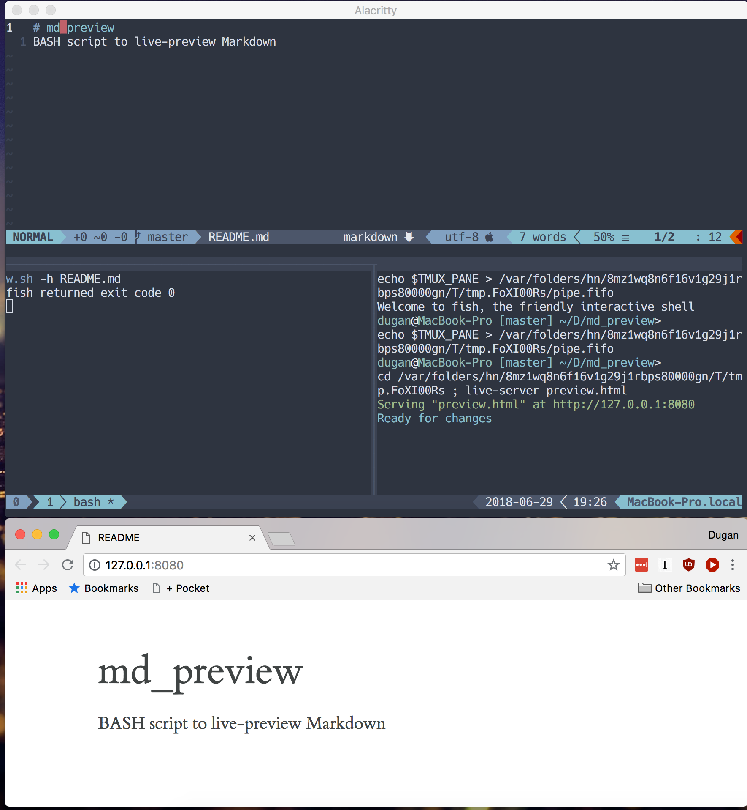

# BASH Script to Preview Markdown File When You're In TMux

This is a BASH script to live-preview Markdown files.

To you it, you need to be in tmux. It takes as a parameter the path to the Markdown file you want to preview. In your current
tmux pane, it starts up a watcher for changes that file. It also opens another tmux pane with a live server to serve up a
preview. In most cases, the preview should then automatically open in your web browser. The preview will update whenever the
Markdown file changes on disk. When you're done, go to the file watcher and press "q". It will close both the watcher and the
server.

## Requirements

It requires the following:

* tmux (running)
* [entr](https://github.com/tapio/live-server) (the file watcher)
* [live-server](https://github.com/tapio/live-server) (to serve the automatically-updating preview)
* [pandoc](https://pandoc.org/) (to convert the Markdown file to HTML)

## Options

The following optional parameters are available:

* **-c** takes the URL to an alternate CSS file
* **-f** takes the input format (GitHub-flavored Markdown if unspecified)
* **-h** (just "-h") splits horizontally instead of vertically

The CSS file, by default, is tufte, from [otsaloma/markdown-css](https://github.com/otsaloma/markdown-css). Alternate
stylesheets need to be served with the correct mimetype. For gist and GitHub links, that means using
[RawGit](https://rawgit.com/) URLs.

Suggestions include:

* killercup's: [gist](https://gist.github.com/killercup/5917178) /
[css](https://rawgit.com/killercup/5917178/raw/8b9903f2d4cc0b2f572f80d2cf3e2380cd264948/pandoc.css)
* benjam's: [homepage](http://benjam.info/panam/) / [css](http://benjam.info/panam/styling.css)

The formats option ("-f") is exactly the same as the corresponding option in pandoc ("-f"), and is directly translated to it.

## Example

In the following screenshot, I opened a split under vim, switched to it, and did:

	./md_preview.sh -h README.md

When I was done, I went to the bottom-left pane and pressed "q". That closed the file watcher and also closed the bottom-right
pane, where the server was.
